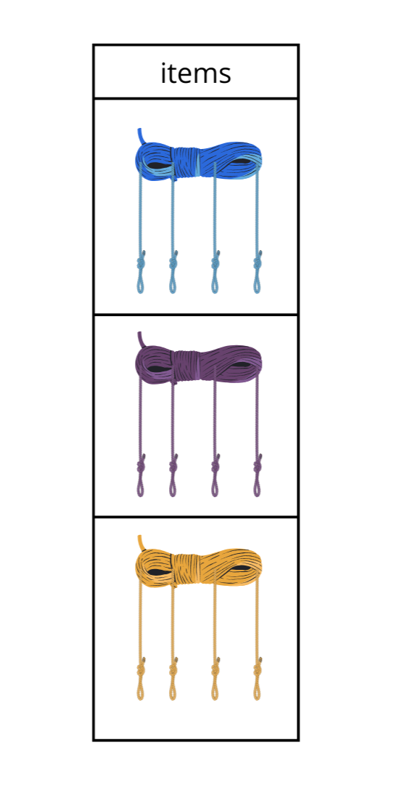

-

 Bienvenidos sean a este proyecto, en el cuál desarrollo el rol de un Científico de datos trabajando para Steam, una plataforma distribuidora de videojuegos.

---

---
---

# Introducción / descripción del proyecto 

Para este proyecto educativo me pidieron que desarrolle un _MVP (Minimun Viable Product / Producto Mínimo Viable)_ para la plataforma distribuidora de videojuegos **Steam**. 

Trabajando cómo científico e ingeniero de datos dentro de Steam, soy el encargado de crear un sistema de recomendación de videojuegos para usuarios. El cuál explico con más detalle [mas adelante.](#-sistemas-de-recomendacion)

Para este proyecto, utilicé una serie de tecnologías, las cuales se listan a continuación:
- Python: Para el despliegue de la API mediante FastAPI y Render
- Jupyter Notebook: Para la creación y desarrollo tanto de los sistemas de recomendación cómo de los endpoints que se me pedían para este proyecto.
- Visual Studio Code: Para escribir el código
- Pandas: Para leer los conjuntos de datos los cuáles explico con más detalle [a continuación.](#conjuntos-de-datos)
- Numpy: Para complementar a la librería pandas.
- Scikit-learn: Para implementar el algoritmo de similitud del coseno, y con ello, desarrollar ambos sistemas de recomendación.
- Uvicorn: Uvicorn es una implementación de servidor web ASGI para Python.
- FastAPI: Para desarrollar la API de manera local, y posteriormente probar su despliegue de forma remota (si es que funcionaba correctamente)
- Matplotlib y seaborn: Para gráficar los datos dentro del EDA
- Render: Para desplegar la API desarrollada previamente mediante FastAPI de forma remota.

---
---

# Conjuntos de datos 

Tengo 3 conjuntos de datos que corresponden a lo que es la base de datos de Steam.

- User_items: En esta tabla, tenemos disponibles todos los datos de los juegos adquiridos por determinados usuarios.
Echando un vistazo a la tabla original nos encontramos con las siguientes columnas:
  - user_id: Identificador único de cada usuario
  - items_count: Cantidad de juegos que tiene el usuario
  - steam_id: El identificador único dentro de steam
  - user_url: El enlace para acceder a la página web dentro de Steam correspondiente al usuario 
  - items: Los juegos del usuario, una columna anidada, de la cuál hablo con más detalle en la parte del [ETL.](#etl)

La cabecera de la tabla originalmente se veía así:

- User_reviews: En esta tabla, tenemos disponibles todas las reseñas hechas por los usuarios a los distitintos juegos que adquirieron. Echando un vistazo a la tabla original, nos encontramos con las siguientes columnas:

  - user_id: El identificador único de cada usuario
  - user_url: El enlace correspondiente a cada usuario.
  - reviews: Las reseñas hechas por el usuario, nuevamente, una columna con datos anidados, que explico con más detalle en la parte del [ETL.](#etl)

Un fragmento de la tabla originalmente se veía así:

- Steam_games: En esta tabla, tenenemos todos los datos correspondientes a los juegos disponibles dentro de Steam, echando un vistazo a sus columnas originales, nos encontramos con:
  - publisher: El publicador / lanzador del juego.
  - genres: Los géneros del juego.
  - app_name: El nombre de la aplicación / juego.
  -	title: El titulo del juego, similar a app_name
  -	url: El enlace dónde se puede encontrar el juego dentro de Steam
  -	release_date: La fecha de salida del juego
  -	tags: Las etiquetas / categorías del juego, similar a genres.
  -	reviews_url: La página web dentro de Steam dónde están disponibles las reseñas hechas al juego.
  -	specs: Las especificaciones del juego, similar a tags y a genres.
  -	price: El precio del juego
  -	early_access: Si hubo o no acceso temprano al juego
  -	id: El identificador único de cada videojuego dentro de Steam
  -	developer: El desarrollador del vídeojuego, similar al publisher. 

La cabecera de la tabla originalmente se veía así:

Con todas estas tablas, sus columnas y sus datos asociados, empecé desde 0 y creé un MVP (Minimun Viable Product) con varias funcionalidades. Pero primero, veamos que alcances tiene el proyecto y los objetivos que cumplí en el mismo.

---
---

# 
 Objetivos y alcances del proyecto 

✅ Transformaciones: para el desarrollo de los [endpoints](#endpoints) y de los [sistemas de recomendación,](#sistemas-de-recomendacion) me encontré con varios inconvenientes, los cuáles explico con más detalle en la parte del [ETL.](#etl)

✅ Análisis exploratorio de datos (EDA): Luego de haber podido leer los datos, me encargué de realizar un análisis exploratorio de los datos, el cuál explico con más detalle en la parte del [EDA.](#eda)

✅ Análisis de sentimientos: A partir del texto de las reseñas hechas por los usuarios hacia determinados juegos, determiné si se trataba de una reseña negativa, neutra o positiva.

✅ Desarrollo óptimo y funcional de una API mediante el framework de FastAPI y su respectivo despliegue en Render. 

✅ Desarrollo e implementación de ciertos [endpoints / funciones](#endpoints) para utilizar dentro de la API.

✅ Desarrollo e implementación de modelos de Machine Learning orientados a dos [sistemas de recomendación de videojuegos.](#sistemas-de-recomendacion)

✅ Todo lo anterior fué logrado mediante muchas horas de dedicación y el desarrollo de un código limpio, prolijo y escalable.

---

# 
 ETL 

## ETL - Introducción

Comencemos por el principio, respondiendo la siguiente pregunta ¿Que es ETL? ETL son siglas en inglés que corresponden a Extract, Transform and Load. En español sería ETC, Extracción, Transformación y Carga.

Pero en nuestro proyecto, ¿Extraer qué? Bueno, el primero de los inconvenientes con los que me encontré cuando comenzaba a desarrollar o más bien querer desarrollar el proyecto, fué el de tratar de leer los archivos correspondientes a los [conjuntos de datos](#conjuntos-de-datos) previamente mencionados.

Los archivos estaban comprimidos en un formato que desconocía (.gzip); era un dataset almacenado en formato JSON y con ayuda de un compañero, implementamos un código capaz de leerlos y almacenarlos dentro de un Dataframe de la librería pandas, con lo cuál se volvió mucho más manejable.

## ETL - User_reviews

En la primera tabla (user_items) hago mención a que la columna "items" era una columna anidada. Y capaz te estés preguntando ¿Que es una columna anidada? Bueno, bajo mi punto de vista, una columna anidada es una columna que en su interior contiene varios datos de distintos tipos, ¿Alguna vez vieron un ovillo de lana? 

Bueno, haciendo una análogia con un ovillo de lana, la columna items de la tabla user_items se veía justamente de la siguiente manera:

Explico con más detalle el procedimiento técnico que seguí con esta tabla (user_items) y sus justificaciones en la carpeta ETL de este mismo proyecto, específicamente en el archivo [ETL_user_items.ipynb.](ETL/ETL_user_items.ipynb) 

Los ovillos compartían la forma / estructura pero eran de distintos tamaños. 

Resumidamente, lo que hice fué lo siguiente:

En cada celda de esta columna, había una lista de diccionarios. Bueno bueno bueno, creo que me estoy poniendo muy nerd / geek...

Bueno, lo que quiero decir con esto, es que la columna se "veía" similar a la siguiente imagen. 

Cómo vemos, los ovillos no eran exactamente ovillos (era una lista de diccionarios), sino que era un conjunto de datos que compartían la misma estructura. Siguiendo con la analogía, en cada celda, había una lista (que sería en este caso la cuerda superior que está atada) y dentro de esta misma estaban contenidas cuerdas. En todas las celdas había 4 cuerdas, lo que cambiaba era el largo de estas 4 cuerdas. Y siendo más claros, el largo de estas 4 cuerdas estaba determinado por una columna llamada items_count, la cuál, mediante un número entero, indicaba cuantos juegos tiene el usuario.

A partir de esta situación, y en base a los requisitos del proyecto, en el proceso de transformación de esta tabla, decidí quedarme sólo con dos columnas: user_id e items. Originalmente la tabla tenía 88310 filas y 5 columnas. Luego de este cambio se quedó con 88310 filas y 2 columnas.

Ahora, ¿por qué decidí dejar esas dos columnas? Esas y otras justificaciones se pueden encontrar en el archivo en dónde le hice el ETL a este conjunto de datos, pero de forma breve y resumida, user_id me daba información de que usuario tenía determinado juego, e items me daba información de los juegos que tenía el usuario.

Si "hiciesemos zoom" a la primera celda por ejemplo, podríamos ver algo así:

Vemos que en la imagen, las 4 cuerdas que colgaban, corresponden a 4 columnas, por eso hacía la analogía. 

Las columnas dentro de la columna item (que en realidad, la columna items si recordamos era una lista de diccionarios, por lo cuál, "sus columnas" eran en realidad las llaves de este diccionario) son:

- item_id: El ID único de cada videojuego.
- item_name: El nombre del juego
- playtime_forever: la cantidad total de tiempo invertido por el usuario en ese juego.
- playtime_2weeks: La cantidad total de tiempo invertido por el usuario las últimas 2 semanas.

En la imagen también se pueden ver 5 filas, pero en realidad, la cantidad de filas era exactamente el valor contenido en la columna previamente eliminada items_count, por ejemplo, para el primer usuario, había 277 filas, que equivalían a 277 juegos que posee ese primer usuario dentro de la tabla user_items.

Cómo esas 277 filas estaban contenidas en **una única celda** (y por eso anteriormente decía que la columna estaba anidada), lo que hice fué desanidar cada una de esas celdas, pudiendo ver así, sus respectivas filas incluidas. Es cómo si hubiese desenrollado el ovillo. 

Hacer esto obviamente multiplicó el tamaño del conjunto de datos enormemente, ya sólo con el primer usuario, tenía 276 filas más, por que cada usuario puede tener más de un juego (y de hecho la mayoría tenía más de un juego). 

La estructura resultante de esta transformación se vió así:

Basicamente conservé todas las "columnas" (pongo entre comillas porque ya aclaré previamente que en realidad eran llaves del diccionario que se repetían en todos los diccionarios) correspondientes a la columna items y conservé la columna user_id al final y la repetí por cada juego que tenga el usuario en cuestión, para saber a quién le corresponde cada juego.

Con esta hermosa transformación pasé de una tabla modesta de 88310 filas x 5 columnas a un monstruo de 5153209 de filas x 5 columnas... 

---

## ETL - User_reviews

Algo similar a lo que hice en la tabla user_items hice con la tabla user_reviews. Originalmente esta tabla tenía 25799 filas x 3 columnas. Y originalmente se veía así:

La columna user_url no la iba a utilizar, así que sólo conservé user_id y reviews. La cosa es que nuevamente tenía la misma situación: un usuario puede hacer más de una reseña, entonces la columna reviews estaba anidada. En su interior contenía nuevamente una lista de diccionarios, con los cuáles, definí que las claves sean columnas. 7 Claves en el interior de cada diccionario (7 cuerdas si seguimos con la analogía), y la cantidad de filas dependía de la cantidad de reseñas que había hecho el usuario, con la diferencía de que no tenía en esta tabla una columna llamada reviews_count o un nombre similar que me indicase la cantidad de reviews por usuario. 
Finalmente, la tabla resultante de la transformación se ve así:

En la anterior imagen podemos observar que la columna correspondiente al user_id lo conservé, y el resto de columnas corresponden a lo que estaba dentro de la columna reviews.

Y colorín colorado, la explicación "sencilla" de las transformaciones se ha terminado. Ya que la tabla steam_games no requirió una importante transformación, sino que la única transformación que tuvo fué la de descompresión del archivo .gzip

---
---

# EDA 

## EDA - Introducción
Al igual que hicimos en la parte del ETL, empecemos respondiendo la siguiente pregunta: ¿Qué es EDA? EDA son las siglas en inglés que corresponden a la frase: "Exploratory Data Analysis", en español sería: "Análisis exploratorio de datos / análisis exploratorio de los datos". Según [nuclio . school:](https://nuclio.school/blog/eda-exploratory-data-analysis/) "El EDA ... es una técnica estadística que apunta a revelar estructuras subyacentes, identificar patrones o anomalías y cualquier indicio de relaciones clave que existan en un conjunto de datos o data set. El objetivo del EDA no es confirmar hipótesis sino que se centra en generar preguntas y sus posibles direcciones para las investigaciones futuras. 
Para entenderlo mejor: el EDA en el Data Science es el arte de hacer preguntas más que el de buscar respuestas específicas.
El EDA se centra en la curiosidad y la apertura mental, tratando de explorar los datos con una mente abierta, sin hipótesis preconcebidas. La aproximación se hace desde un entendimiento más profundo y holístico de los datos". Me encantó la definición, y por eso la compartí.
Básicamente el proceso de EDA es un proceso inicial que idealmente debería hacerse con cada conjunto de datos con el cuál se esté trajando, para conocerlo más en profundidad. En este proyecto, al tener 3 conjuntos de datos, me tocó hacerles un EDA a cada uno de ellos.

---
## EDA - Steam_games
Este fué el primer conjunto de datos al cuál le apliqué el proceso de EDA.
De forma muy breve y resumida (todos los procedimientos hechos se pueden encontrar en el archivo [EDA_steam_games.ipynb,](EDA/EDA_steam_games.ipynb)) identifiqué y traté los datos nulos, principalmente eran filas completamente vacías, que representaban casi la totalidad del dataset cómo se puede ver en el siguiente gráfico:

También borré las columnas que no consideré óptimas para el desarrollo de los endpoints y de los sistemas de recomendación y presenté algunos gráficos para visualizar mejor la información. Dejando las que se muestran a continuación:

Y de estas mismas columnas, terminé borrando ciertas filas, "cortando" el dataframe a la altura de la línea roja:

Otra de los inconvenientes con los cuáles me encontré, fué que este Dataframe tenía una columna correspondiente a los precios de los videojuegos. El problema con esta columna fué que no eran valores númericos cómo uno esperaría, sino que eran valores object, cómo podemos ver a continuación:

Esto me traía inconvenientes que rápidamente solucioné, mediante la transformación de aquellas celdas que decían "Free" o "Free to play" al equivalente númerico: 0

Esa y otras cosas más interesantes se pueden encontrar dentro del archivo en el cuál hice el proceso de EDA al conjunto de datos correspondiente a steam_games. Estas transformaciones me sirvieron muchísimo para el desarrollo del primer [endpoint.](#endpoints)

---
## EDA - User_items
Todos los procedimientos hechos se pueden encontrar en el archivo [EDA_user_items.ipynb,](EDA/EDA_user_items.ipynb) en el mismo presenté gráficos para visualizar mejor la información proporcionada por los datos.

---
## EDA - User_reviews
Todos los procedimientos hechos se pueden encontrar en el archivo [EDA_user_reviews.ipynb,](EDA/EDA_user_reviews.ipynb) en el mismo presenté gráficos para visualizar mejor la información proporcionada por los datos.

---
---

#  Endpoints 

- Primer endpoint: Para la función correspondiente al primer endpoint, la consigna era la siguiente:

Entonces desarrolle una función que hace lo siguiente: Primero, evalúa si el desarrollador ingresado en la función existe en el dataset, si no existe, lanza el siguiente error: "Developer not found". Si el desarrollador si existe en el dataset, la función ingresa en un bucle que itera sobre cada año de manera única en los que el desarrollador sacó al menos un videojuego. 
Por ejemplo, si en 2015 sacó 3 juegos, en 2016 sacó 2 y en 2017 sacó 4, esos años aparecen 3, 2 y 4 veces respectivamente, por lo cuál, lo que hace el bucle es tomar esos años cómo valores únicos, apareciendo sólo una vez el 2015, el 2016 y el 2017.

Dentro del bucle, se crea una variable interna que cambia con cada iteración del mismo, la cuál almacena la cantidad de juegos que el desarrollador, esto lo hace (explicado de forma simple y resumida) aplicando un "filtro" para que busque la cantidad de veces que aparece ese desarrollador ingresado en la función y ese año que está definido por el bucle.
Luego, cuenta la cantidad de items gratuitos, esto lo hace nuevamente con otro "filtro" similar al anterior, sólo que agregandole el detalle que esta vez, el precio tiene que ser igual a 0.
Estos dos valores se almacenan en una variable llamada "pre_salida", que es un diccionario, el cuál tiene cómo pares clave valor lo siguiente: "{
            "Cantidad items": int(cant_items_anual), 
            "Contenido gratuito (%)": f"{(cant_items_gratuitos_anual / cant_items_anual) * 100}%"
        }". Luego la variable salida, osea, lo que finalmente muestra la función , lo que tiene de caracteristico es que tiene el año que se está iterando, por lo cuál, la salida quedaría de esta forma:
        {
          Año:{"Cantidad items": int(cant_items_anual), 
            "Contenido gratuito (%)": f"{(cant_items_gratuitos_anual / cant_items_anual) * 100}%"}
        }

---
---

# Sistemas de recomendacion

Primero aclaro que, la palabra recomendación no tiene acento en el título porque si lo ponía no me dejaba agregar la funcionalidad de que, al hacer click te redirija a esta parte del README. 

Habiendo dejado eso en claro, empecemos por lo básico, respondiendo a la siguiente pregunta, ¿Qué es un sistema de recomendación?
Según [Aprende machine learning . com](https://www.aprendemachinelearning.com/sistemas-de-recomendacion/)
"...son algoritmos que intentan 'predecir' los siguientes ítems (en nuestro proyecto, juegos) que querrá adquirir un usuario en particular."
Estamos rodeados de sistemas de recomendación, en Instagram por ejemplo, cuando comenzamos a ver reels, y hacemos "scroll" (deslizar para ver el siguiente contenido), el próximo vídeo que nos aparezca, es aquel que el algoritmo de Instagram nos ha recomendado.
En YouTube, cuando estamos viendo un video y nos aparece un "recomendado" o "para tí" es exactamente lo mismo. 

Para el sistema de recomendación, la consigna era la siguiente:

Lo que decidí hacer fué usar una columna que había agregado en el dataset de juegos, llamada "categorical", en ella se alojaban todos los datos pertinentes al juego "tags", "genres" y "specs", usando scikit-learn, vectoricé esa columna y a partir de esa vectorización, utilicé el algoritmo de similitud del coseno. El cuál de lo que se encarga (de forma simple y muy resumida) es de encontrar palabras similares a las del juego ingresado. Por ejemplo, ingresamos el id de cierto juego que sabemos que es de acción, lo que hace ese algoritmo (nuevamente recalco, de forma simple y muy resumida) es buscar otros juegos que también sean de acción y de tematicas similares. Para nosotros quizás resulte simple saber que por ejemplo el Counter Strike es similar al Call of Duty (dos juegos de disparos), pero para un algoritmo que sólo entiende números no, es por eso que el proceso de ETL previamente realizado era de suma importancia para crear esa columna artificial llamada "categorical" y buscar los juegos a partir de allí.

---
---

# Conclusión y cierre

Cómo conclusión y cierre, se podría terminar de hacer las otras funciones para que el trabajo quede completamente realizado, y terminar de especificar los detalles que requieren ciertas columnas, cómo por ejemplo, el tiempo de juego de un usuario, que no se sabe si está medido en horas, minutos o segundos, y es un dato bastante relevante.
Saludos y muchas gracias.