-

 Bienvenidos sean a este proyecto, en el cuál desarrollo el rol de un Científico de datos trabajando para Steam, una plataforma distribuidora de videojuegos.

---

---
---

# Introducción / descripción del proyecto 

Para este proyecto educativo me pidieron que desarrolle un _MVP (Minimun Viable Product / Producto Mínimo Viable)_ para la plataforma distribuidora de videojuegos **Steam**. 

Trabajando cómo científico e ingeniero de datos dentro de Steam, soy el encargado de crear un sistema de recomendación de videojuegos para usuarios. El cuál explico con más detalle [mas adelante.](#-sistemas-de-recomendacion)

Para este proyecto, utilicé una serie de tecnologías, las cuales se listan a continuación:
- Python: Para el despliegue de la API mediante FastAPI y Render
- Jupyter Notebook: Para la creación y desarrollo tanto de los sistemas de recomendación cómo de los endpoints que se me pedían para este proyecto.
- Visual Studio Code: Para escribir el código
- Pandas: Para leer los conjuntos de datos los cuáles explico con más detalle [a continuación.](#conjuntos-de-datos)
- Numpy: Para complementar a la librería pandas.
- Scikit-learn: Para implementar el algoritmo de similitud del coseno, y con ello, desarrollar ambos sistemas de recomendación.
- Uvicorn: Uvicorn es una implementación de servidor web ASGI para Python.
- FastAPI: Para desarrollar la API de manera local, y posteriormente probar su despliegue de forma remota (si es que funcionaba correctamente)
- Matplotlib y seaborn: Para gráficar los datos dentro del EDA
- Render: Para desplegar la API desarrollada previamente mediante FastAPI de forma remota.

---
---

# Conjuntos de datos 

Tengo 3 conjuntos de datos que corresponden a lo que es la base de datos de Steam.

- User_items: En esta tabla, tenemos disponibles todos los datos de los juegos adquiridos por determinados usuarios.
Echando un vistazo a la tabla original nos encontramos con las siguientes columnas:
  - user_id: Identificador único de cada usuario
  - items_count: Cantidad de juegos que tiene el usuario
  - steam_id: El identificador único dentro de steam
  - user_url: El enlace para acceder a la página web dentro de Steam correspondiente al usuario 
  - items: Los juegos del usuario, una columna anidada, de la cuál hablo con más detalle en la parte del [ETL.](#etl)

La cabecera de la tabla originalmente se veía así:
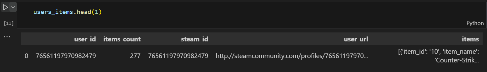

- User_reviews: En esta tabla, tenemos disponibles todas las reseñas hechas por los usuarios a los distitintos juegos que adquirieron. Echando un vistazo a la tabla original, nos encontramos con las siguientes columnas:

  - user_id: El identificador único de cada usuario
  - user_url: El enlace correspondiente a cada usuario.
  - reviews: Las reseñas hechas por el usuario, nuevamente, una columna con datos anidados, que explico con más detalle en la parte del [ETL.](#etl)

Un fragmento de la tabla originalmente se veía así:
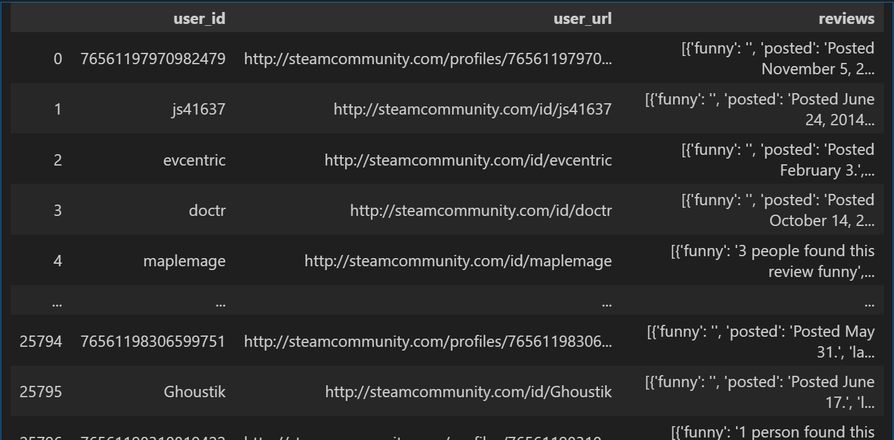

- Steam_games: En esta tabla, tenenemos todos los datos correspondientes a los juegos disponibles dentro de Steam, echando un vistazo a sus columnas originales, nos encontramos con:
  - publisher: El publicador / lanzador del juego.
  - genres: Los géneros del juego.
  - app_name: El nombre de la aplicación / juego.
  -	title: El titulo del juego, similar a app_name
  -	url: El enlace dónde se puede encontrar el juego dentro de Steam
  -	release_date: La fecha de salida del juego
  -	tags: Las etiquetas / categorías del juego, similar a genres.
  -	reviews_url: La página web dentro de Steam dónde están disponibles las reseñas hechas al juego.
  -	specs: Las especificaciones del juego, similar a tags y a genres.
  -	price: El precio del juego
  -	early_access: Si hubo o no acceso temprano al juego
  -	id: El identificador único de cada videojuego dentro de Steam
  -	developer: El desarrollador del vídeojuego, similar al publisher. 

La cabecera de la tabla originalmente se veía así:
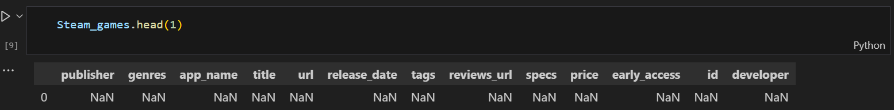

Con todas estas tablas, sus columnas y sus datos asociados, empecé desde 0 y creé un MVP (Minimun Viable Product) con varias funcionalidades. Pero primero, veamos que alcances tiene el proyecto y los objetivos que cumplí en el mismo.

---
---

# 
 Objetivos y alcances del proyecto 

✅ Transformaciones: para el desarrollo de los [endpoints](#endpoints) y de los [sistemas de recomendación,](#sistemas-de-recomendacion) me encontré con varios inconvenientes, los cuáles explico con más detalle en la parte del [ETL.](#etl)

✅ Análisis exploratorio de datos (EDA): Luego de haber podido leer los datos, me encargué de realizar un análisis exploratorio de los datos, el cuál explico con más detalle en la parte del [EDA.](#eda)

✅ Análisis de sentimientos: A partir del texto de las reseñas hechas por los usuarios hacia determinados juegos, determiné si se trataba de una reseña negativa, neutra o positiva.

✅ Desarrollo óptimo y funcional de una API mediante el framework de FastAPI y su respectivo despliegue en Render. 

✅ Desarrollo e implementación de ciertos [endpoints / funciones](#endpoints) para utilizar dentro de la API.

✅ Desarrollo e implementación de modelos de Machine Learning orientados a dos [sistemas de recomendación de videojuegos.](#sistemas-de-recomendacion)

✅ Todo lo anterior fué logrado mediante muchas horas de dedicación y el desarrollo de un código limpio, prolijo y escalable.

---

# 
 ETL 

## ETL - Introducción

Comencemos por el principio, respondiendo la siguiente pregunta ¿Que es ETL? ETL son siglas en inglés que corresponden a Extract, Transform and Load. En español sería ETC, Extracción, Transformación y Carga.

Pero en nuestro proyecto, ¿Extraer qué? Bueno, el primero de los inconvenientes con los que me encontré cuando comenzaba a desarrollar o más bien querer desarrollar el proyecto, fué el de tratar de leer los archivos correspondientes a los [conjuntos de datos](#conjuntos-de-datos) previamente mencionados.

Los archivos estaban comprimidos en un formato que desconocía (.gzip); era un dataset almacenado en formato JSON y con ayuda de un compañero, implementamos un código capaz de leerlos y almacenarlos dentro de un Dataframe de la librería pandas, con lo cuál se volvió mucho más manejable.

## ETL - User_reviews

En la primera tabla (user_items) hago mención a que la columna "items" era una columna anidada. Y capaz te estés preguntando ¿Que es una columna anidada? Bueno, bajo mi punto de vista, una columna anidada es una columna que en su interior contiene varios datos de distintos tipos, ¿Alguna vez vieron un ovillo de lana? 

Bueno, haciendo una análogia con un ovillo de lana, la columna items de la tabla user_items se veía justamente de la siguiente manera:

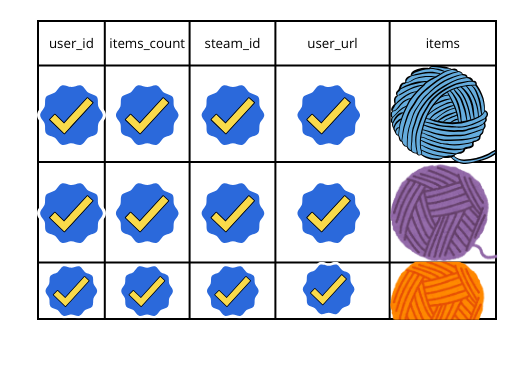

Explico con más detalle el procedimiento técnico que seguí con esta tabla (user_items) y sus justificaciones en la carpeta ETL de este mismo proyecto, específicamente en el archivo [ETL_user_items.ipynb.](ETL/ETL_user_items.ipynb) 

Los ovillos compartían la forma / estructura pero eran de distintos tamaños. 

Resumidamente, lo que hice fué lo siguiente:

En cada celda de esta columna, había una lista de diccionarios. Bueno bueno bueno, creo que me estoy poniendo muy nerd / geek...

Bueno, lo que quiero decir con esto, es que la columna se "veía" similar a la siguiente imagen. 

Cómo vemos, los ovillos no eran exactamente ovillos (era una lista de diccionarios), sino que era un conjunto de datos que compartían la misma estructura. Siguiendo con la analogía, en cada celda, había una lista (que sería en este caso la cuerda superior que está atada) y dentro de esta misma estaban contenidas cuerdas. En todas las celdas había 4 cuerdas, lo que cambiaba era el largo de estas 4 cuerdas. Y siendo más claros, el largo de estas 4 cuerdas estaba determinado por una columna llamada items_count, la cuál, mediante un número entero, indicaba cuantos juegos tiene el usuario.

A partir de esta situación, y en base a los requisitos del proyecto, en el proceso de transformación de esta tabla, decidí quedarme sólo con dos columnas: user_id e items. Originalmente la tabla tenía 88310 filas y 5 columnas. Luego de este cambio se quedó con 88310 filas y 2 columnas.

Ahora, ¿por qué decidí dejar esas dos columnas? Esas y otras justificaciones se pueden encontrar en el archivo en dónde le hice el ETL a este conjunto de datos, pero de forma breve y resumida, user_id me daba información de que usuario tenía determinado juego, e items me daba información de los juegos que tenía el usuario.

Si "hiciesemos zoom" a la primera celda por ejemplo, podríamos ver algo así:

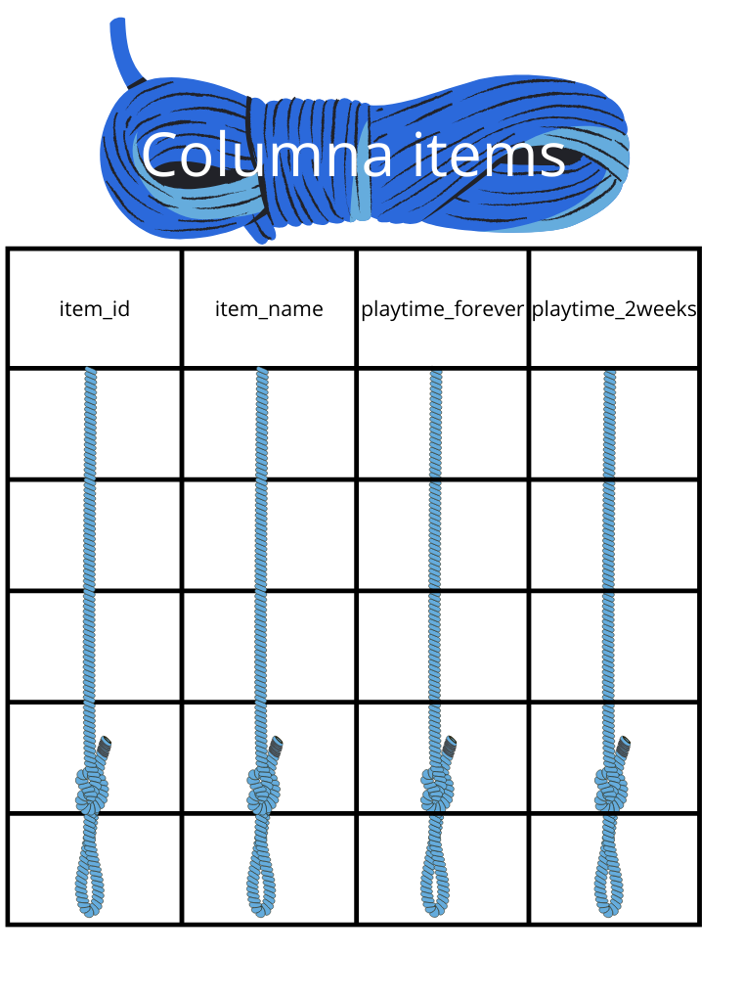

Vemos que en la imagen, las 4 cuerdas que colgaban, corresponden a 4 columnas, por eso hacía la analogía. 

Las columnas dentro de la columna item (que en realidad, la columna items si recordamos era una lista de diccionarios, por lo cuál, "sus columnas" eran en realidad las llaves de este diccionario) son:

- item_id: El ID único de cada videojuego.
- item_name: El nombre del juego
- playtime_forever: la cantidad total de tiempo invertido por el usuario en ese juego.
- playtime_2weeks: La cantidad total de tiempo invertido por el usuario las últimas 2 semanas.

En la imagen también se pueden ver 5 filas, pero en realidad, la cantidad de filas era exactamente el valor contenido en la columna previamente eliminada items_count, por ejemplo, para el primer usuario, había 277 filas, que equivalían a 277 juegos que posee ese primer usuario dentro de la tabla user_items.

Cómo esas 277 filas estaban contenidas en **una única celda** (y por eso anteriormente decía que la columna estaba anidada), lo que hice fué desanidar cada una de esas celdas, pudiendo ver así, sus respectivas filas incluidas. Es cómo si hubiese desenrollado el ovillo. 

Hacer esto obviamente multiplicó el tamaño del conjunto de datos enormemente, ya sólo con el primer usuario, tenía 276 filas más, por que cada usuario puede tener más de un juego (y de hecho la mayoría tenía más de un juego). 

La estructura resultante de esta transformación se vió así:

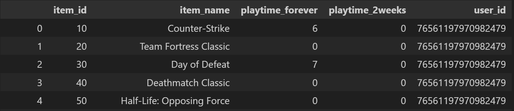

Basicamente conservé todas las "columnas" (pongo entre comillas porque ya aclaré previamente que en realidad eran llaves del diccionario que se repetían en todos los diccionarios) correspondientes a la columna items y conservé la columna user_id al final y la repetí por cada juego que tenga el usuario en cuestión, para saber a quién le corresponde cada juego.

Con esta hermosa transformación pasé de una tabla modesta de 88310 filas x 5 columnas a un monstruo de 5153209 de filas x 5 columnas... 

---

## ETL - User_reviews

Algo similar a lo que hice en la tabla user_items hice con la tabla user_reviews. Originalmente esta tabla tenía 25799 filas x 3 columnas. Y originalmente se veía así:

La columna user_url no la iba a utilizar, así que sólo conservé user_id y reviews. La cosa es que nuevamente tenía la misma situación: un usuario puede hacer más de una reseña, entonces la columna reviews estaba anidada. En su interior contenía nuevamente una lista de diccionarios, con los cuáles, definí que las claves sean columnas. 7 Claves en el interior de cada diccionario (7 cuerdas si seguimos con la analogía), y la cantidad de filas dependía de la cantidad de reseñas que había hecho el usuario, con la diferencía de que no tenía en esta tabla una columna llamada reviews_count o un nombre similar que me indicase la cantidad de reviews por usuario. 
Finalmente, la tabla resultante de la transformación se ve así:
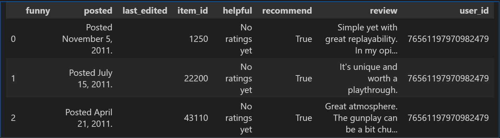

En la anterior imagen podemos observar que la columna correspondiente al user_id lo conservé, y el resto de columnas corresponden a lo que estaba dentro de la columna reviews.

Y colorín colorado, la explicación "sencilla" de las transformaciones se ha terminado. Ya que la tabla steam_games no requirió una importante transformación, sino que la única transformación que tuvo fué la de descompresión del archivo .gzip

---
---

# EDA 

## EDA - Introducción
Al igual que hicimos en la parte del ETL, empecemos respondiendo la siguiente pregunta: ¿Qué es EDA? EDA son las siglas en inglés que corresponden a la frase: "Exploratory Data Analysis", en español sería: "Análisis exploratorio de datos / análisis exploratorio de los datos". Según [nuclio . school:](https://nuclio.school/blog/eda-exploratory-data-analysis/) "El EDA ... es una técnica estadística que apunta a revelar estructuras subyacentes, identificar patrones o anomalías y cualquier indicio de relaciones clave que existan en un conjunto de datos o data set. El objetivo del EDA no es confirmar hipótesis sino que se centra en generar preguntas y sus posibles direcciones para las investigaciones futuras. 
Para entenderlo mejor: el EDA en el Data Science es el arte de hacer preguntas más que el de buscar respuestas específicas.
El EDA se centra en la curiosidad y la apertura mental, tratando de explorar los datos con una mente abierta, sin hipótesis preconcebidas. La aproximación se hace desde un entendimiento más profundo y holístico de los datos". Me encantó la definición, y por eso la compartí.
Básicamente el proceso de EDA es un proceso inicial que idealmente debería hacerse con cada conjunto de datos con el cuál se esté trajando, para conocerlo más en profundidad. En este proyecto, al tener 3 conjuntos de datos, me tocó hacerles un EDA a cada uno de ellos.

---
## EDA - Steam_games
Este fué el primer conjunto de datos al cuál le apliqué el proceso de EDA.
De forma muy breve y resumida (todos los procedimientos hechos se pueden encontrar en el archivo [EDA_steam_games.ipynb](EDA/EDA_steam_games.ipynb)) identifiqué y traté los datos nulos, principalmente eran filas completamente vacías, que representaban casi la totalidad del dataset cómo se puede ver en el siguiente gráfico:

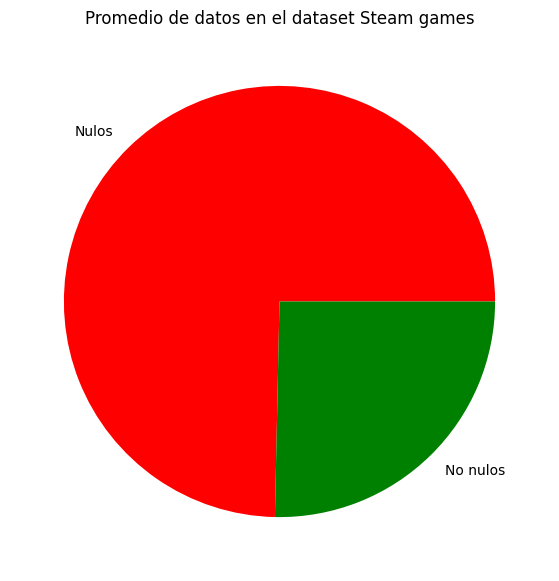

También borré las columnas que no consideré óptimas para el desarrollo de los endpoints y de los sistemas de recomendación y presenté algunos gráficos para visualizar mejor la información. Dejando las que se muestran a continuación:

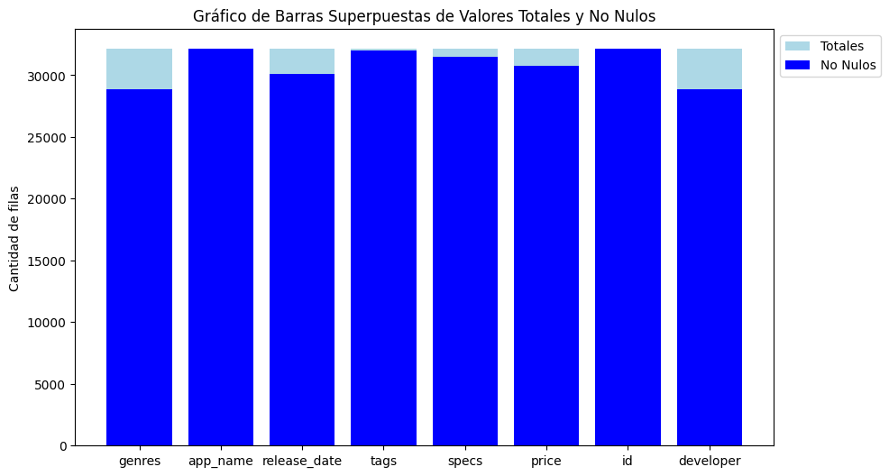

Y de estas mismas columnas, terminé borrando ciertas filas, "cortando" el dataframe a la altura de la línea roja:

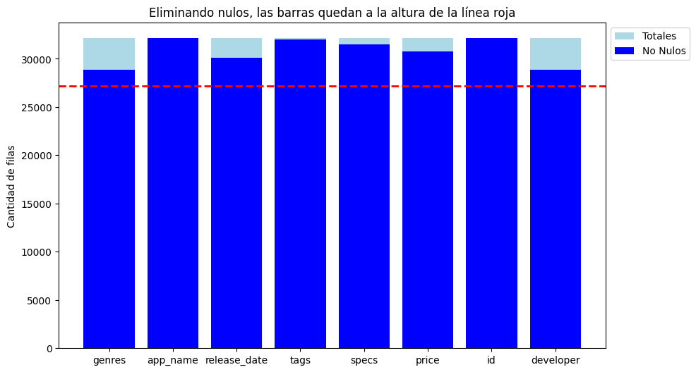

Otra de los inconvenientes con los cuáles me encontré, fué que este Dataframe tenía una columna correspondiente a los precios de los videojuegos. El problema con esta columna fué que no eran valores númericos cómo uno esperaría, sino que eran valores object, cómo podemos ver a continuación:

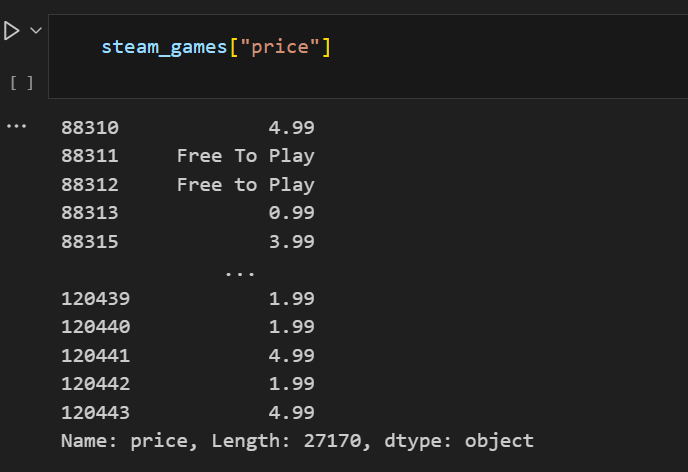

Esto me traía inconvenientes que rápidamente solucioné, mediante la transformación de aquellas celdas que decían "Free" o "Free to play" al equivalente númerico: 0

Esa y otras cosas más interesantes se pueden encontrar dentro del archivo en el cuál hice el proceso de EDA al conjunto de datos correspondiente a steam_games. Estas transformaciones me sirvieron muchísimo para el desarrollo del primer [endpoint.](#endpoints)

---
## EDA - User_items

También realicé el proceso de EDA al conjunto de datos correspondiente a user_items, cómo curiosidad, no había datos nulos en este conjunto de datos. 

Identifiqué cuales fueron los juegos más jugados por los usuarios:
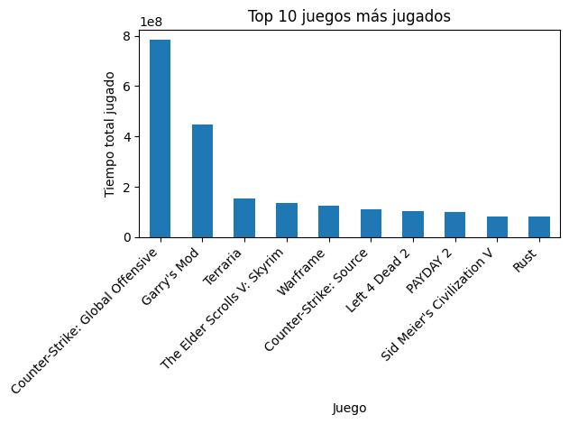

Gracias a esta gráfica y algunas conclusiones propias (las cuáles podes leer con más detalle en el archivo [EDA_user_items.ipynb](EDA/EDA_user_items.ipynb)), determiné que el tiempo está (muy posiblemente, porque a ciencia cierta no lo sé) medido en minutos. Observemos la cantidad de tiempo invertida por el top 10 más frikis de Steam (lo de frikis va con amor xD):

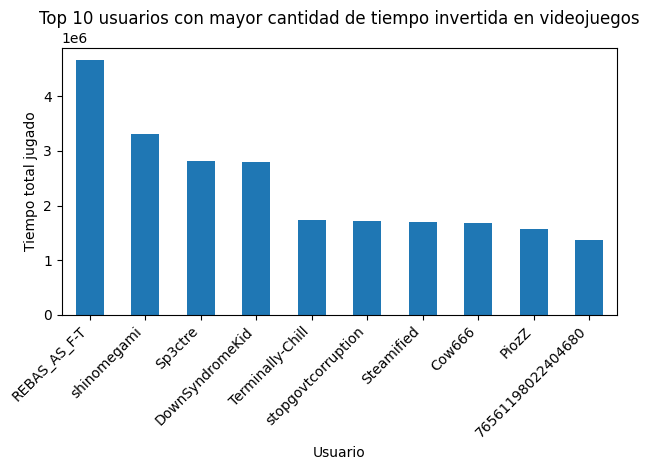

Podemos ver que el primero, con user_id: "REBAS_AS_F-T", acumula un total de 4660393 (cuatro millones seiscientos sesenta mil trescientos noventa y tres) en playtime_forever. Si fuesen horas, dividiendo por 24 para obtener la cantidad de días obtendríamos un poco más de 194183, si a este número lo dividimos por 365 para obtener la cantidad de años jugados por el usuario, obtenemos un poco más de 532 años.
Me imagino que la mayoría estaremos de acuerdo que ese tal Rebas se vería algo así:

Pero bueno, cómo biologicamente por ahora no es posible vivir hasta los 532 años, consideré que la unidad de tiempo podría estar en minutos en lugar de horas, entonces la formula sería algo así: 4660393 / 60 = Horas jugadas = 776973.22, si a ese número lo dividimos por 24 para obtener los días nos queda: Días jugados = 3236.38, y si a ese número lo dividimos por 365 tenemos que ese usuario pasó un poco más de 8.8 años de su vida jugando videojuegos. Vemos que es sensato pensar que la unidad de tiempo está medida en minutos. Incluso quizás podrían ser segundos, pero para mi análisis consideré que eran minutos. 

---
## EDA - User_reviews

Finalmente, le toca el turno al conjunto de datos correspondiente a user_reviews.
Una de las cosas más importantes al momento de hacer un EDA es ver la cantidad de nulos que hay dentro de la tabla que se está analizando, y esto es lo que representé mediante la siguiente gráfica, muy similar a la usada en steam_games, me gustó el formato.

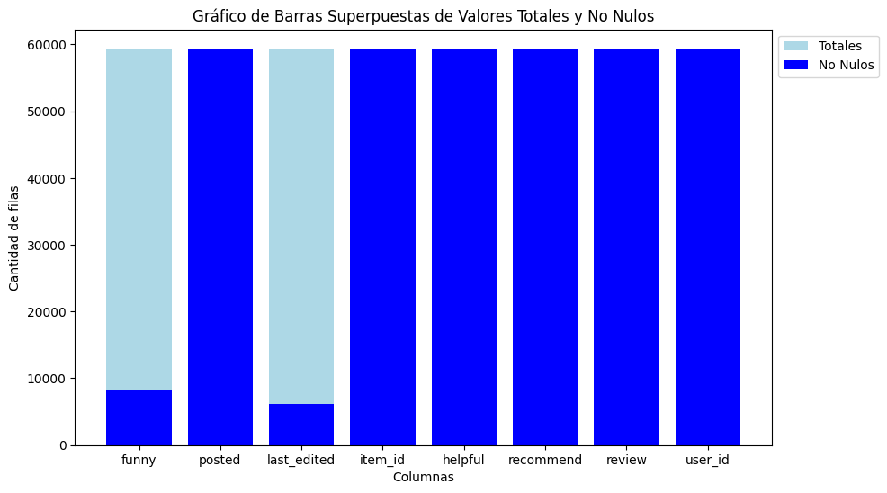

La columna "funny" y "last_edited" llaman particularmente la antención por la cantidad de nulos que contienen. Por un lado, la columna "funny" da información de la cantidad de personas que esa reseña en cuestión les resultó graciosa. Al haber tanta cantidad de nulos, podemos concluir que no todas las reseñas le resultaron graciosas a las personas que las leyeron (muchas, probablemente ni siquiera hayan sido leídas 😭). Por otro lado, algo similar  sucedía con la columna "last_edited", ya que la misma informaba acerca de la fecha en la que se hizo la última edición de la reseña en cuestión. Y tiene sentido pensar que no todas las reseñas fueron editadas luego de su creación (y de hecho, la mayoría de ellas no lo fueron).

Por otro lado, la reseña que los usuarios encontraron más divertida fué la siguiente: "This game is:10% luck,20% skill,15% concentrated power of will,5% pleasure,50% pain,100% reason to purchase the game." (Este juego es:10% suerte, 20% habilidad,15% poder de la voluntad concentrado,5% placer, 50% dolor,100% razón para comprar el juego).

Por otro lado, cómo podemos observar en la siguiente gráfica:

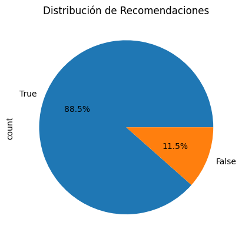

La mayor parte de los usuarios que hicieron una reseña fué para recomendar el juego en cuestión (88,5%).

Podemos ver también una evolución temporal de las reseñas a lo largo del tiempo:

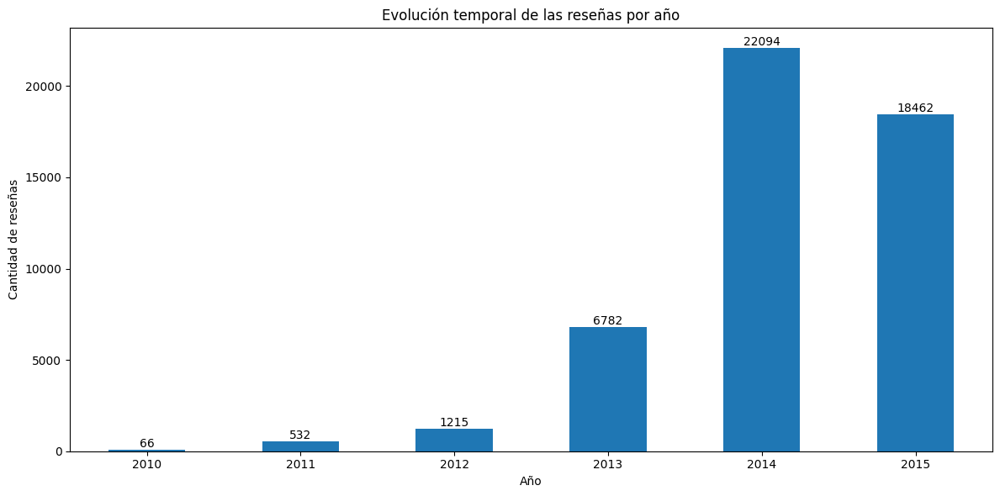

Está, y mucha otra información, además de todos los procedimientos hechos se pueden encontrar en el archivo [EDA_user_reviews.ipynb.](EDA/EDA_user_reviews.ipynb)

Con todo lo anterior dicho, podemos proseguir a la parte de la creación y desarrollo de los endpoints.

---
---

#  Endpoints 

## Endpoints - Introducción

### Endpoints - Introducción - Definición de API

Cómo hice con las anteriores secciones, me parece necesario hacerla también con esta sección, empezaremos entonces definiendo, ¿Qué es un endpoint? Pero para entender que es un endpoint, primero tenemos que entender ¿Qué es una API? Según [CLOUDFARE,](https://www.cloudflare.com/es-es/learning/security/api/what-is-an-api/) "Una interfaz de programación de aplicaciones (API) es un conjunto de reglas que permiten que un programa transmita datos a otro programa.", y continúa con: "Las API permiten a los desarrolladores evitar el trabajo redundante; en lugar de construir y reconstruir funciones de aplicaciones que ya existen, los desarrolladores pueden incorporar las existentes a su nueva aplicación al formatear las solicitudes como requiere la API.

Una API es una "interfaz", es decir, una forma de que una cosa interactúe con otra. Si utilizamos un ejemplo del mundo real, un cajero automático tiene una interfaz, una pantalla y varios botones, que permite que los clientes interactúen con su banco y soliciten servicios, como sacar dinero. Del mismo modo, una API es la forma en que una pieza de software interactúa con otro programa para obtener los servicios necesarios.".

Otra cosa que dice: "Imaginemos que Jennifer diseña un sitio web que ayuda a los viajeros a comprobar el tráfico de las autovías antes de salir a trabajar. Jennifer podría dedicar mucho tiempo y dinero a crear un complejo sistema de seguimiento de las autovías para ofrecer esta información a los usuarios de su sitio web. Pero estas funciones ya existen, ya que otros han creado estos sistemas. En lugar de reinventar la rueda, el sitio web de Jennifer utiliza una API que ofrece un servicio externo de seguimiento de autovías. Ahora, Jennifer puede centrarse en diseñar otros aspectos del sitio web."

La imagen que vemos a continuación describe muy bien cómo funcionan las API REST

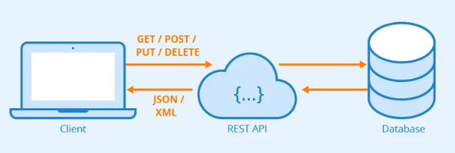

Cómo vemos, el usuario (la persona que interactúa con la interfaz) hace un pedido (eso de GET, POST, etc) y la API lo que devuelve es un JSON o un XML.

Con esto un poco más claro, veamos ahora la definición de un endpoint

### Endpoints - Introducción - Definición de endpoint

Anteriormente dije que para saber que es un endpoint, primero debíamos saber que era una API, y ahora entenderan por qué. En [CLOUDFARE](https://www.cloudflare.com/es-es/learning/security/api/what-is-api-endpoint/) encontré esta respuesta a la definición de endpoint: "Si Alice y Bob están hablando por teléfono, las palabras de Alice se dirigen a Bob y viceversa. Alice dirige sus palabras al 'punto final' (endpoint) de la conversación: Bob.

Alice: "Hola, Bob" ----------> Bob

Del mismo modo, una integración de API es como una conversación. Pero en lugar de decir 'Hola', un cliente de API dice algo como 'Necesito algunos datos' al servidor de la API a través de una llamada API. El punto final (endpoint) del servidor de la API responde 'Aquí están los datos' - respuesta de la API. Los puntos finales (endpoints) de la API no son entidades físicas como Alice y Bob. Existen en el software, no en el hardware."

Para este proyecto me pidieron que cree y desarrolle 5 endpoints funcionales, cada uno con sus respectivas útilidades, los cuáles se listan y explican a continuación.

## Endpoints - Primero

Para la función correspondiente al primer endpoint, la consigna era la siguiente:

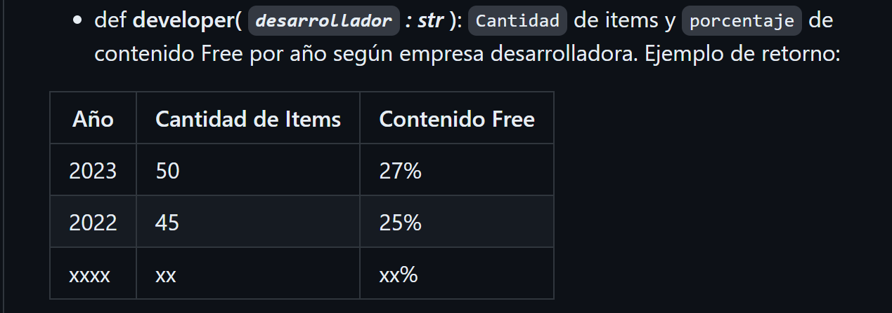

Para el desarrollo de este primer endpoint, utilicé unicamente el conjunto de datos llamado "steam_games", ya que ese conjunto de datos me ofrecía toda la información necesaria para el desarrollo del mismo. 

Lo principal que tuve que hacer fué limpiar y transformar el conjunto de datos, para dejarlo de la forma más óptima posible. 

La mayor parte del desarrollo de este endpoint se puede encontrar en el archivo correspondiente al [EDA,](EDA/EDA_steam_games.ipynb) y aunque también una parte de la explicación se encuentra en el archivo que corresponde al [endpoint,](endpoints/endpoint_1.ipynb) prácticamente ya lo tenía hecho antes de crear el archivo, y la creación de este mismo fué a modo de justificación (ya que lo había hecho con todos los demás endpoints, excepto con este) 

Un ejemplo de la salida sería esta (primero hay que oprimir el botón "Try it out"):

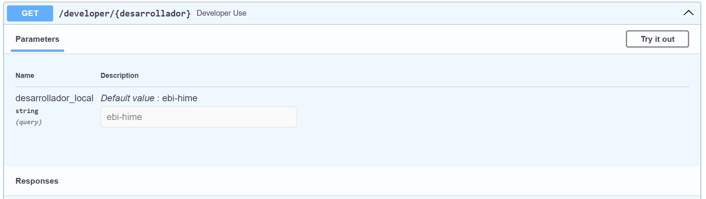

Luego de tocar ese botón, aparece abajo un nuevo botón celeste que dice "Execute", cuando ese botón se oprime, se muestra el resultado (se puede ver dónde dice: "Response body"):

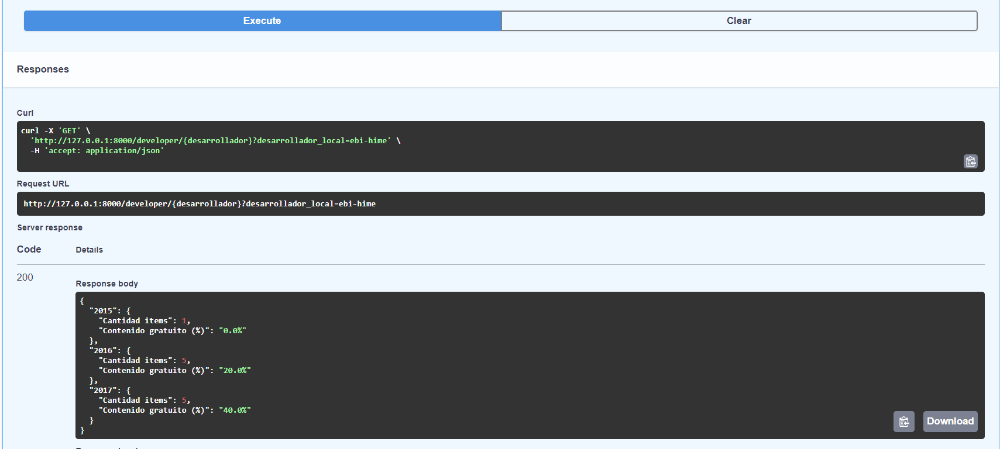

Vemos en este ejemplo que la desarrolladora de vídeojuegos "ebi-hime" en 2015 sacó 1 juego y no era gratuito, en 2016 sacó 5 juegos y tuvo un 20% de juegos gratuitos, etc.

Te invito a probar este endpoint y los demás con este [archivo,](endpoints/parametros_validos_endpoints.txt) el cuál contiene todos los parametros válidos para los 5 endpoints.

## Endpoints - Segundo

Para la función correspondiente al segundo endpoint, la consigna era la siguiente:

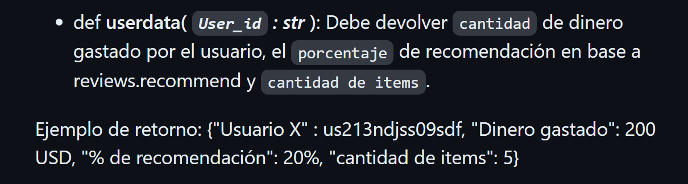

Todo el desarrollo con detalle correspondiente a este endpoint se puede encontrar en este [archivo,](endpoints/endpoint_2.ipynb) más a continuación voy a explicar de forma muy breve y resumida que fué lo que hice para el desarrollo del mismo.

Para desarrollar este endpoint, tuve que utilizar los 3 conjuntos de datos. Primeramente el de user_items, ya que lo que se ingresaba a la función era la ID del usuario, y una de las cosas que se pretendía saber con este endpoint era la cantidad de items (videojuegos) que tenía el usuario. Si recordamos, el archivo original de user_items contenía una columna llamada items_count, esta columna fué mi salvación en este endpoint, ya que me permitió optimizar enormemente el mismo. ¿Por qué? Porque la tabla original de user_items tenía 88310 filas, y la tabla desanidada me había quedado con 5153209 filas. 

Por otro lado, también necesitaba el conjunto de datos correspondiente a steam_games, ya que la función también tenía que devolver la cantidad de dinero gastado, y para obtener este valor, tuve que conectar ambas tablas [por un lado la tabla de user_items desanidada, la cuál tenía información de cada juego (o más bien, su correspondiente ID) que tenía el usuario, y por el otro la tabla de steam_games, la cuál tenía información de los precios de dichos juegos] usando el ID de los juegos.

Una parte de la tabla resultante se veía así:

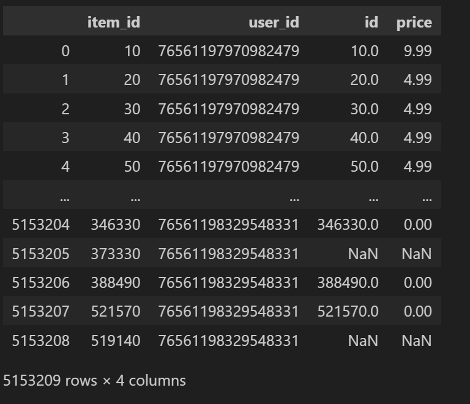

A partir de esta conexión (merge), pude hacer una sumatoria del precio para obtener la cantidad total de dinero gastado por el usuario. Pero nuevamente volvía a tener el mismo problema de la cantidad de filas, lo cuál era muy demandante a nivel computo, y llenaba la memoria que Render ofrece en su capa gratuita, por lo cuál, decidí crear una tabla a partir de esta misma, que tenía sólo el nombre de usuario y el total de dinero gastado por el mismo. Cómo curiosidad, tardó 3 horas en recorrerse el bucle que hizo posible esto, y una parte del resultado se veía así:

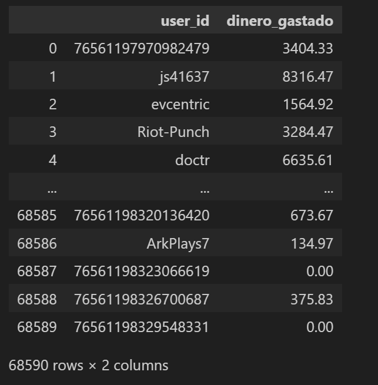

Pasando con esta transformación de más de 5000000 de filas a menos de 70000.

Por último, en esta función también me pedían que devuelva el porcentaje de recomendación, y ese dato estaba disponible en la otra tabla, user_reviews. Lo que hice fué usar una regla de 3 simple, a partir de la cantidad total de juegos del usuario (la cuál determiné cómo 100%), supongamos 277 cómo el primer usuario, conté la cantidad de recomendaciones que hizo el usuario en la tabla user_reviews. Suponiendo que hubiese hecho 28, tendría un porcentaje de recomendación del 10%.

Finalmente la salida en el desarrollo del prototipo se veía así:

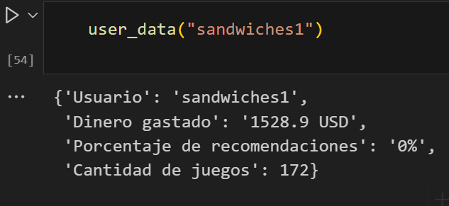

## Endpoints - Tercero
## Endpoints - Cuarto
## Endpoints - Quinto

---
---

# Sistemas de recomendación

## Sistemas de recomendación - Introducción

Primero aclaro que, la palabra recomendación no tiene acento en el título porque si lo ponía no me dejaba agregar la funcionalidad de que, al hacer click te redirija a esta parte del README. 

Habiendo dejado eso en claro, empecemos por lo básico, respondiendo a la siguiente pregunta, ¿Qué es un sistema de recomendación?
Según [Aprende machine learning . com](https://www.aprendemachinelearning.com/sistemas-de-recomendacion/)
"...son algoritmos que intentan 'predecir' los siguientes ítems (en nuestro proyecto, juegos) que querrá adquirir un usuario en particular."
Estamos rodeados de sistemas de recomendación, en Instagram por ejemplo, cuando comenzamos a ver reels, y hacemos "scroll" (deslizar para ver el siguiente contenido), el próximo vídeo que nos aparezca, es aquel que el algoritmo de Instagram nos ha recomendado.
En YouTube, cuando estamos viendo un video y nos aparece un "recomendado" o "para tí" es exactamente lo mismo. 

## Sistemas de recomendación - Primero

Para el primer sistema de recomendación, la consigna era la siguiente:

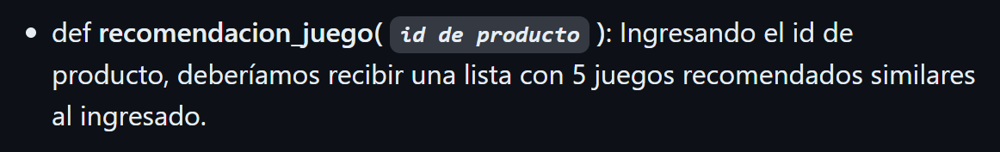

Lo que decidí hacer fué usar una columna que había agregado en el dataset de juegos, llamada "categorical", en ella se alojaban todos los datos pertinentes al juego "tags", "genres" y "specs", usando scikit-learn, vectoricé esa columna y a partir de esa vectorización, utilicé el algoritmo de similitud del coseno. El cuál de lo que se encarga (de forma simple y muy resumida) es de encontrar palabras similares a las del juego ingresado. Por ejemplo, ingresamos el id de cierto juego que sabemos que es de acción, lo que hace ese algoritmo (nuevamente recalco, de forma simple y muy resumida) es buscar otros juegos que también sean de acción y de tematicas similares. Para nosotros quizás resulte simple saber que por ejemplo el Counter Strike es similar al Call of Duty (dos juegos de disparos), pero para un algoritmo que sólo entiende números no, es por eso que el proceso de ETL previamente realizado era de suma importancia para crear esa columna artificial llamada "categorical" y buscar los juegos a partir de allí.

## Sistemas de recomendación - Segundo

---
---

# Conclusión y cierre

Cómo conclusión y cierre, se podría terminar de hacer las otras funciones para que el trabajo quede completamente realizado, y terminar de especificar los detalles que requieren ciertas columnas, cómo por ejemplo, el tiempo de juego de un usuario, que no se sabe si está medido en horas, minutos o segundos, y es un dato bastante relevante.
Saludos y muchas gracias.